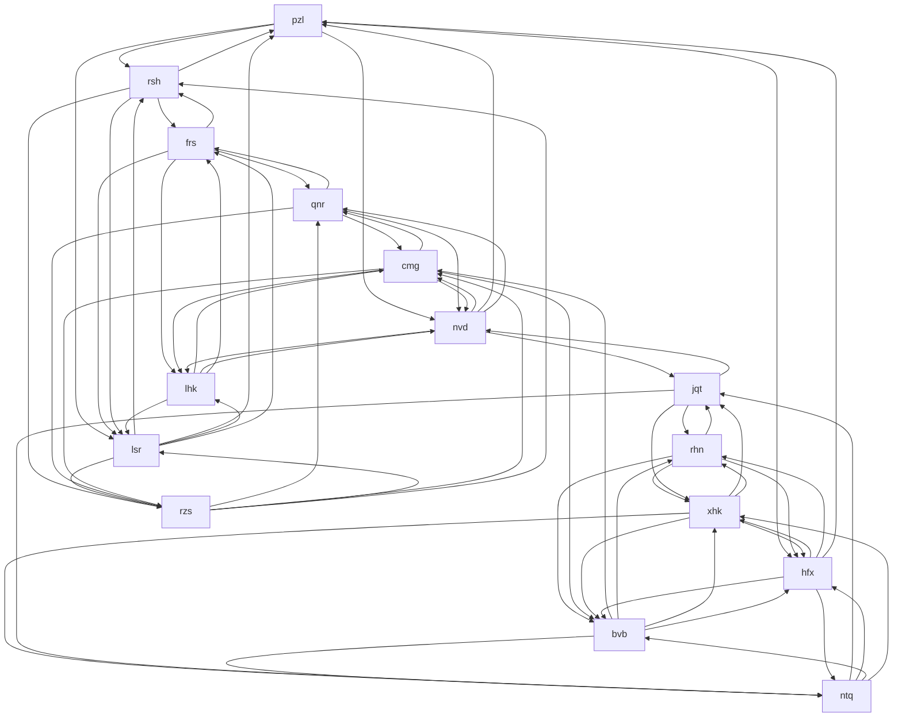

```mermaid
graph TD
    pzl-->rsh;
    pzl-->lsr;
    pzl-->hfx;
    pzl-->nvd;
    frs-->rsh;
    frs-->qnr;
    frs-->lhk;
    frs-->lsr;
    rhn-->jqt;
    rhn-->xhk;
    rhn-->bvb;
    rhn-->hfx;
    bvb-->cmg;
    bvb-->rhn;
    bvb-->xhk;
    bvb-->hfx;
    bvb-->ntq;
    rsh-->frs;
    rsh-->pzl;
    rsh-->lsr;
    rsh-->rzs;
    lsr-->rsh;
    lsr-->pzl;
    lsr-->lhk;
    lsr-->rzs;
    lsr-->frs;
    qnr-->cmg;
    qnr-->nvd;
    qnr-->rzs;
    qnr-->frs;
    cmg-->qnr;
    cmg-->nvd;
    cmg-->lhk;
    cmg-->bvb;
    cmg-->rzs;
    nvd-->jqt;
    nvd-->cmg;
    nvd-->pzl;
    nvd-->qnr;
    nvd-->lhk;
    xhk-->jqt;
    xhk-->hfx;
    xhk-->rhn;
    xhk-->bvb;
    xhk-->ntq;
    lhk-->cmg;
    lhk-->nvd;
    lhk-->lsr;
    lhk-->frs;
    jqt-->rhn;
    jqt-->xhk;
    jqt-->nvd;
    jqt-->ntq;
    hfx-->xhk;
    hfx-->rhn;
    hfx-->bvb;
    hfx-->pzl;
    hfx-->ntq;
    rzs-->qnr;
    rzs-->cmg;
    rzs-->lsr;
    rzs-->rsh;
    ntq-->jqt;
    ntq-->hfx;
    ntq-->bvb;
    ntq-->xhk;
```